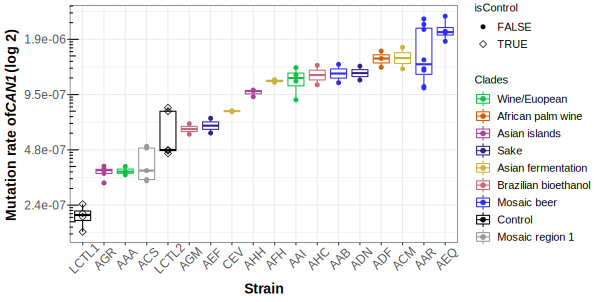

To generate fig 3, simply run
[plot_mut_rate_fig3.R](https://github.com/harrispopgen/elife_CAN1_paper/blob/main/fluc/est_m_basic.R) in this directory, which utilized [rsalvador](https://github.com/eeeeeric/rSalvador) package. 

It uses two files to calculate mutation rates per replicate: the mutation count per fluctuation experiment is in `fluc_mut_count_summary_CAN1.csv`, 
and total cell number estimate is in `fluc_cell_count_all.csv`. 

Then it generates the boxplot of mutation rates per strain. 

## Figure 3:

